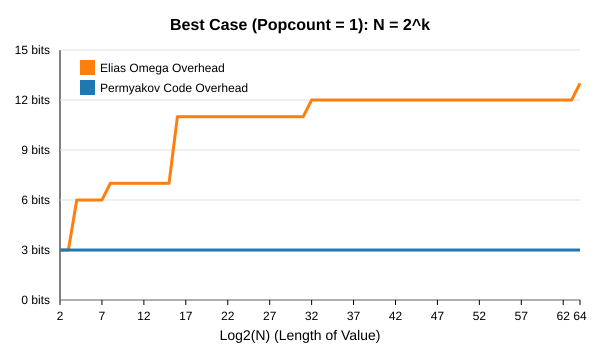
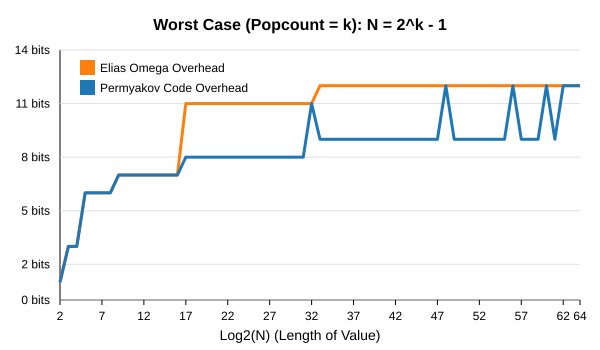

# Permyakov Code

A highly efficient, popcount-based universal code for integer compression. It serves as a faster and often more compact alternative to standard bit-level Elias Omega codes and byte-level Varint (LEB128/VByte) encodings.

## The Algorithm

The encoding is conceptually inspired by Elias Omega but replaces the recursive bit-length encoding with **popcount** (the number of set bits in the value). This makes it extremely fast on modern CPUs thanks to hardware popcount instructions.

To solve the inherent issue of trailing zeros when decoding by popcount (because we wouldn't know when a block ends if it had trailing zeros), **the bits within each block are written in reverse order (from LSB to MSB)**. The sequence of blocks itself is written in reverse generation order. 

### Encoding Steps:
1. **Generate the sequence**: Starting with the number `N`, calculate its popcount (number of `1`s). Take that popcount and calculate *its* popcount, repeating until the value is $\le 3$.
2. **Write the Base Prefix**: The final value (1, 2, or 3) is encoded as a 2-bit prefix: `01` for 1, `10` for 2, `11` for 3.
3. **Write the Blocks**: Write all preceding blocks in reverse sequence (from smallest to largest). For each block, write its bits **from LSB to MSB**, omitting leading zeros.
4. **Terminator**: Append a final `1` bit to mark the end of the code.

### Decoding Steps:
1. Read the first 2 bits to determine how many `1`s to expect in the next block.
2. Read bits one by one until you have seen the expected number of `1`s. Because we reversed the bit order during encoding, trailing zeros (which are now leading zeros in the reversed bitstream) are naturally handled: we just keep reading until we hit the required number of set bits.
3. The value we just read becomes the required number of `1`s for the *next* block.
4. Repeat until you hit the terminator bit `1`.

## Theoretical Dominance

**Permyakov Code strictly dominates Elias omega: overhead is always ≤ omega, with equality only for $N = 2^k - 1$.**

The fundamental property of the Permyakov Code is that its metadata overhead is driven by the Hamming weight (`popcount`) rather than the bit-length (`log2`). For any integer $N$, the following strict inequality holds:

$$ \text{popcount}(N) \leq \lfloor\log_2 N\rfloor + 1 $$

Because the popcount sequence converges strictly faster than the bit-length sequence used by Elias Omega for the vast majority of integers, the structural overhead is substantially reduced.

### Best Case vs Worst Case Overhead
The charts below visualize the structural overhead (metadata bits excluding the raw binary value of $N$) as the number grows up to $2^{60}$.

**1. Best Case ($N = 2^k$):** The number contains a single `1` bit.

*While Elias Omega overhead grows logarithmically, Permyakov Code overhead remains perfectly constant at 3 bits.*

**2. Worst Case ($N = 2^k - 1$):** All bits are `1`.

*Even in its absolute worst-case scenario, the Permyakov Code overhead never exceeds Elias Omega.*

---

## Benchmarks

### 1. Permyakov Codes vs Elias Omega (General Distribution)
When encoding numbers from 1 to 1,000,000, Permyakov Codes provide significant savings in structural overhead compared to standard Elias Omega.

| Metric | Permyakov Code | Elias Omega |
|--------|---------------|-------------|
| Total Overhead | **6,896,424 bits** | 10,737,553 bits |
| Size | **64.2%** of Omega | 100% |

**Advantage:** Permyakov meta-data overhead is ~36% smaller than Elias Omega, while being significantly faster to encode/decode due to hardware `popcount`.

### 2. Permyakov Codes vs Varint (VByte) in Inverted Indexes
In a real-world scenario like an inverted index (where we encode *deltas* between sorted IDs), we require a log-based index to achieve $O(\log K)$ Random Access.

We benchmarked a dense array (1 Million elements, average delta ~2) where both the data and a recursive Skip-List/B-Tree index are compressed. For Permyakov Codes, the index offsets are compressed using Permyakov Codes without padding. For Varint, the index offsets are compressed using Varint.

| Structure (Dense Array) | Permyakov + Index | Varint + Index |
|-------------------------|------------------|----------------|
| Data Size               | 3,909,855 bits   | 8,000,000 bits |
| Index Overhead          | 3,984,031 bits   | 3,397,664 bits |
| **Total Size**          | **7,893,886 bits** | **11,397,664 bits** |

**Advantage:** On dense delta-arrays (the standard in search engines like Lucene), **Permyakov is 1.44x smaller** than Varint even with a full recursive index included!

---

## Running the Benchmarks

This repository contains a Rust MVP demonstrating the algorithm and the benchmarks.

```bash
cargo run --release
```

## License
MIT